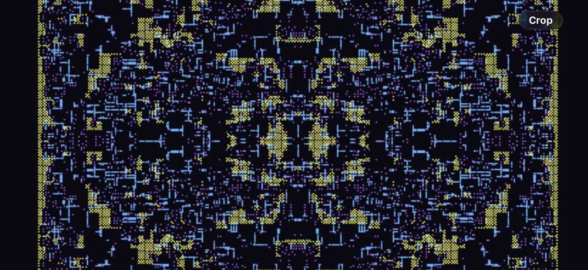
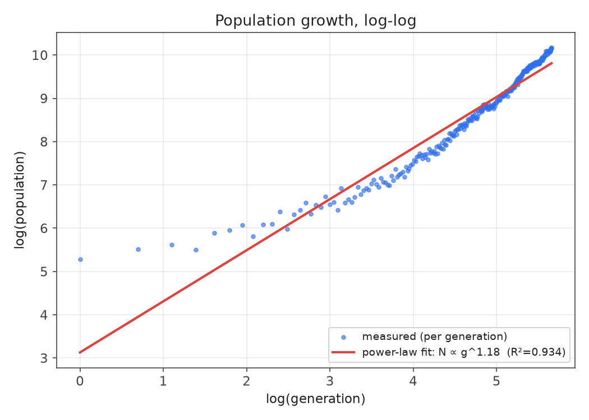
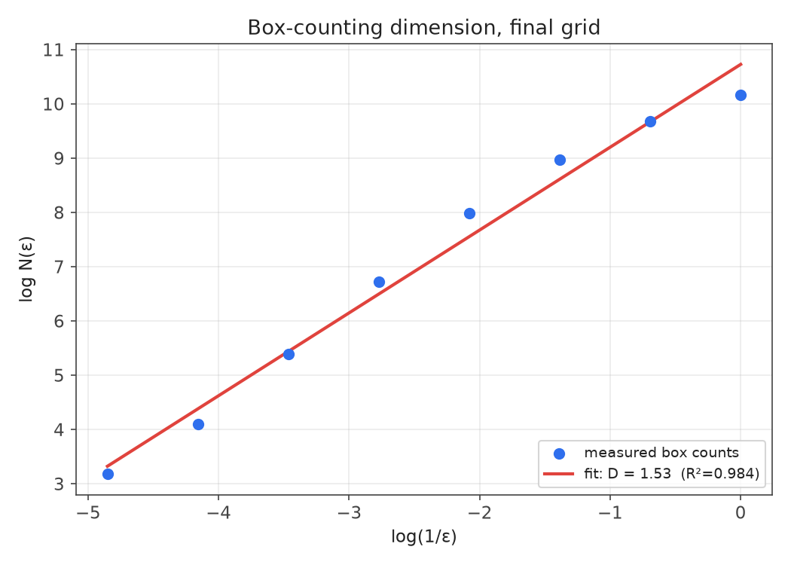

# My Cellular Automata System

An engine that computes cell states from local transition rules and renders them on a
resizable, zoomable grid, built to test how much self-similar structure can emerge from rules
that act only on a cell's neighbors. Growth (linear struts, diagonal leaves), long-range
connectivity, and local density regulation are combined to prevent convergence to trivial
steady states. A 134-cell seed grows past tens of thousands of cells of sustained,
self-similar structure that holds up under magnification.

### ***Watch the demo By clicking the picture below***

 [](https://www.youtube.com/watch?v=I_RSyR-6C6Q)

## What it is, formally

A 5-state (1 quiescent background + PINK, BLUE, YELLOW, PURPLE), deterministic,
synchronously-updated 2D automaton with a heterogeneous, rule-dependent neighborhood rather
than one fixed radius:

| Rule | Neighborhood | Character |
|---|---|---|
| PINK growth | von Neumann, read r=2 / write r=1 | non-totalistic, position-specific |
| YELLOW growth | diagonal r=1 (not full Moore) | non-totalistic, position-specific |
| BLUE wiring | 4 cardinal rays, range up to 7 | non-local, direction-limited |
| PURPLE pruning | Moore r=1 (9-cell block incl. self) | outer-totalistic, threshold ≥8/9 occupied |

Only the pruning rule counts neighbors; the three growth rules test presence/absence of
specific offset cells. The whole grid is invariant under the **Klein four-group**
{identity, reflect-x, reflect-y, rotate-180°} — two mirror axes plus point symmetry — enforced
by explicit reflection every generation ([Cellular_Automata.py:48-54](Cellular_Automata.py#L48-L54)).

## Measured behavior

Numbers below come from an actual instrumented run (`ca_headless_analysis.py`), not from
inference — see [`ca_run_log.txt`](ca_run_log.txt) for the full log and
[`ca_headless_results.json`](ca_headless_results.json) for the raw data. The run used a
reproducible 134-cell stand-in seed (the original hand-drawn seed wasn't recorded) and ran
287 generations, reaching 25,994 cells before being capped for wall-clock reasons —
per-generation cost grows with population.

**Growth law** — population vs. generation, log-log:



N(g) ≈ g^1.18 (power-law fit, R²=0.934) — mildly super-linear, not quadratic. A linearly
expanding boundary would predict an exponent near 2; the measured exponent is far short of
that because local density regulation continuously quenches interior density back to single
points (1,284,783 prune events over the run) rather than letting regions fill in as solid
area.

**Fractal dimension** — box-counting on the final grid:



D ≈ 1.53 (R²=0.984 across 7 octaves of scale, ε = 1 to 128), a number that supports the idea of "fractal", strictly between a 1-dimensional skeleton and a 2-dimensional filled region.

**Trivial steady states** — global population extinction is structurally unreachable (growth
rules only add cells; pruning always leaves a center cell behind). But each color is a
one-way, non-regenerating species — only a cell of color X ever spawns more of color X, so
once a color's population hits zero it cannot reappear. Per-species extinction is a real trivial steady state
distinct from population-level extinction.

**Symmetry** — confirmed empirically, not just by inspection: asymmetric at generation 0 (raw
seed), exactly Klein-four-symmetric from generation 1 onward.

## Repository contents

- [`Cellular_Automata.py`](Cellular_Automata.py) — the interactive pygame simulation (mouse to
  draw, arrows/WASD to pan, +/- to zoom, Enter to run, Space to step, R to reset).
- [`ca_headless_analysis.py`](ca_headless_analysis.py) — headless port of the transition rule
  (no pygame/display dependency) used to measure growth law, box-counting dimension, symmetry,
  and prune-event statistics.
- [`ca_run_log.txt`](ca_run_log.txt) — full console output of the analysis run.
- [`ca_headless_results.json`](ca_headless_results.json) — raw per-generation data and fit
  results from that run.
- [`make_charts.py`](make_charts.py) — regenerates the two charts above from the JSON/log data.

## Running it

```bash
pip install pygame
python Cellular_Automata.py
```

To reproduce the analysis:

```bash
python ca_headless_analysis.py
python make_charts.py
```
